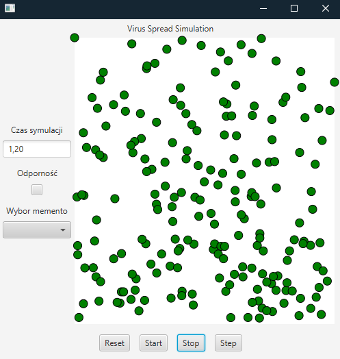
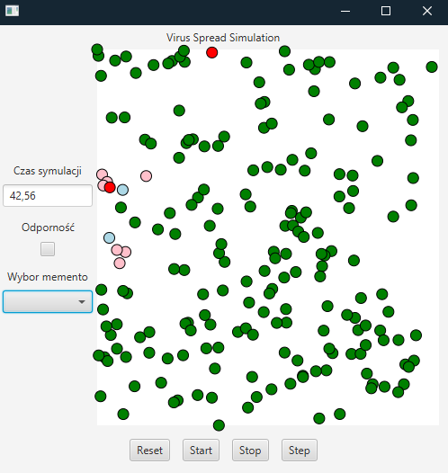
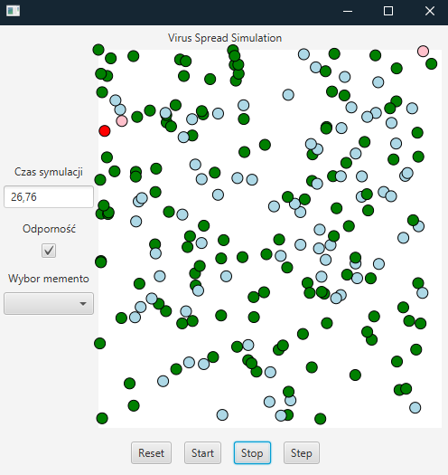
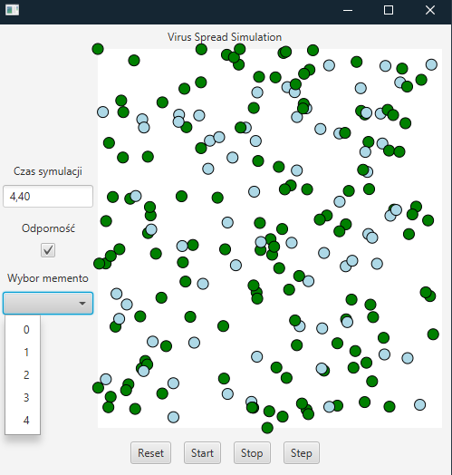

# virusSpread
> Virus spread simulation based on JavaFX

## Table of Contents
* [General Info](#general-information)
* [Technologies Used](#technologies-used)
* [Features](#features)
* [Screenshots](#screenshots)

## General Information
- This app is simulation of virus spread in society. This include healthy people - green, immune - blue, infected without sympthons - pink, infected with sympthons - red.
- Infected people can affect healthy by standing next to them in 2m radius for at least 3s. After 30s infected people change their state to immune. Every 1s of simulation contain
25 steps. 

## Technologies Used
- Java
- JavaFX
- Maven
- Git
- Github

## Features
List the ready features here:
- You choose if starting population will have immunity or not.
- Every 1s there is snapshot taken of whole board with states and position. After stoping you can choose snapshot to rollback.

## Screenshots
<!--  -->

